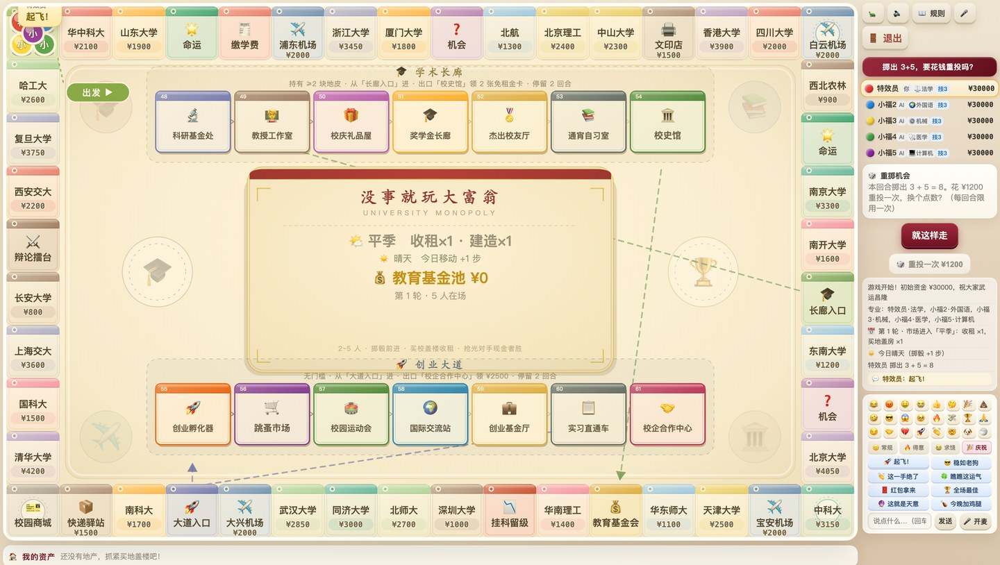
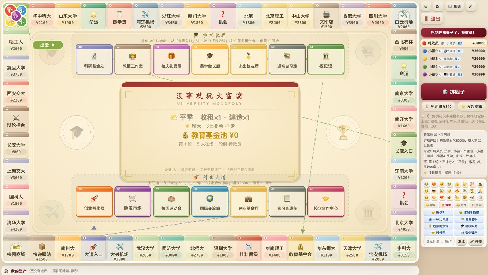
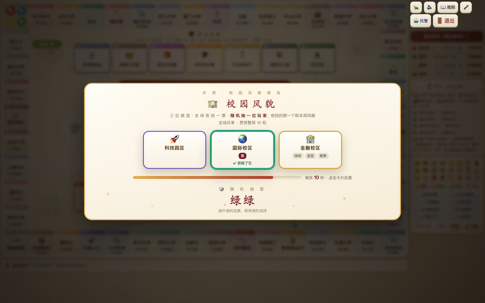
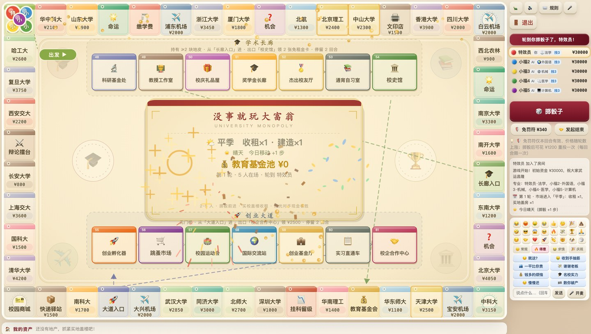

<div align="center">

# 没事就玩大富翁

**2~5 人联机网页大富翁 · 打开链接就能开一局**

没有客户端，不用注册 —— 发一个 6 位房间号，朋友输进去就能进来。

[🎮 在线试玩](https://fudan-monopoly.app.workbuddy.host/)

**当前版本：v5.7**（2026-10-03）

[](https://github.com/kylian567/university-monopoly/actions/workflows/ci.yml) [](LICENSE) 



</div>

---

## 这是什么

一款**纯网页的联机大富翁**：把 30 所中国名校买下来，靠收租把朋友逼到破产。房主建房拿到一个 6 位房间号，朋友在大厅输入即入局；人不够可以补 AI 到 5 人，中途挂机可以**一键托管给 AI**（AI 有拟人化的小动作与颜色名）。

支持麦克风语音房、24 个表情、32 句快捷语音（发出去**只有语音本身**——不带「某某说」前缀、也不会重复回响，而且每句带各自的语气），以及一整套粒子特效与 **99 种音效**。**出局后转观战仍可开麦、发弹幕**。

## 玩法要点

| 机制 | 说明 |
|---|---|
| **棋盘** | 48 格环形主路线（16 × 10 排布），棋盘正中还有两条各 7 格的岔路 |
| **回合** | 每个回合只做三件事：掷骰 → 落格 → 结算 |
| **买地** | 落到无主的地可以买下；自己不买时进入全场拍卖 |
| **造访升级制** | 不靠「盖房」堆，靠反复造访自己的地升级：十档色组（棕 → 紫），建造费从 ¥850 递增到 ¥4100，顶级旅馆租金最高 ¥27720；集齐同色组裸地租金 ×3 |
| **租金四重系数** | 最终租金 = 基准租金 × 季节系数 × 天气系数 × 校历系数 × 连击系数，是「乘」出来的 |
| **抵押** | 只在**盖房时**或**现金不足**时可抵押（换地价 50% 现金）；抵押地**不收租、也不必缴物业税**，且**两个轮次内不可赎回**（赎回键带锁，到点自动解锁） |
| **机会 / 命运** | 各 65 张卡，一股力量扶弱、一股力量劫富；拆地 / 拆房改为**真随机**且优先挑没盖房的，另有百分比收益、切换专业、连抽两轮、下两回合加速等新玩法 |
| **道具与效果卡** | 免罚符（分段涨价、当轮过期）/ 免租金卡 / 免租券，消耗顺序固定；校园商城另有 **7 张效果卡盲盒**（随机抽 1~2 张） |
| **两条岔路** | 学术长廊（低风险奖励线，需持 ≥2 块地）vs 创业大道（无门槛，赌一把）；12 个岔路格全部重做，走上去会**全场演出抽取过程** |
| **市场周期** | 淡季 / 平季 / 旺季价格双向浮动；**8 种天气**（晴 +1 步 / 雨 −1 步 / 台风租金 ×0.7 / 雾 · 雪 · 酷热 · 大风），每 3 轮一次**校历事件（共 29 种）**，各带专属特效与音效 |
| **校园风貌** | 开局先投票定基调：**23 种风貌 23 选 3**，全员投票 + 大屏抽签（四幕演出），本局全局生效——有的加成有的带代价，免费轮 / 免租轮还会**提前公告具体轮次** |
| **研究项目 · 海克斯** | 第 **2 / 10 / 20** 轮全员三选一：**54 个项目**分银🥈 / 金🥇 / 彩💎三档，档位完全随机（三档概率逐次向高级漂移），全场发牌**不重复**；彩色卡有旋转彩虹光环 + 彩带金币雨大屏演出，点右侧玩家名牌可随时查看他人的项目 / 技能卡 / 资产 |
| **成长与对抗** | **60 个专业身份**（含 **13 个主动技**：到点弹窗问你要不要发动）、7 个成就、连击加成，还能在擂台 / 运动会直接向对手发起对决 |
| **结束** | 第 15 轮起银行停发工资，全场转入存量博弈；一局约 40 ~ 60 分钟 |

<div align="center">



**🧪 研究项目 · 三选一**（棱彩档 · 深色实验室风） | **🏫 校园风貌 · 全员推选**




**👀 点击右侧玩家名，随时查看他人的项目 / 技能卡 / 资产**


</div>

## 快速开始

需要 **Node.js ≥ 18**，没有任何 npm 依赖。

```bash
git clone https://github.com/kylian567/university-monopoly.git
cd university-monopoly/app
node server.js
```

然后打开 <http://localhost:3000> 即可。想和朋友联机，把 `localhost` 换成你机器的局域网 IP。

## 项目结构

```
university-monopoly/
├── app/                     # 游戏本体（零依赖 Node.js）
│   ├── server.js            # HTTP 静态服务 + 房间路由 + WebSocket / SSE
│   ├── game.js              # 游戏引擎：棋盘、规则、结算、AI（纯逻辑，可离线跑）
│   ├── simulate.js          # AI 自动对局
│   ├── test_v5*.js          # 引擎单测（v5.1~v5.7 每版一份，向下兼容回归）
│   ├── test_v40.js          # 引擎单测（v4.x 回归）
│   ├── test_majors.js       # 引擎单测（60 个专业）
│   ├── smoke_v5*.js         # Playwright 端到端冒烟（支持 BASE_URL 验收线上）
│   └── public/              # 前端
│       ├── index.html
│       ├── client.js        # 渲染 + 粒子特效 + 音效 + 语音
│       └── style.css
├── docs/screenshots/        # README 配图
├── 游戏设计文档.md           # 完整设计文档（棋盘表 / 数值表 / 机制说明 / 版本历史）
└── LICENSE
```

## 实现要点

- **服务端权威**：`game.js` 是独立的纯逻辑引擎，服务端算完再广播状态，客户端只负责渲染。开源改成单机版只需换掉传输层。
- **动画与结算解耦**：服务端在事件里附带「本次新变更了什么」的**增量**（现金 / 地块 / 基金池），前端先播动画、**动画播完才把资金与资产刷到屏幕上**——钱不会先于动画变化，且现金条、资产面板、评论区同刻刷新。
- **掷骰落点虚影**：掷出点数后若可重投，会直接在地图上用**虚影**标出「按现在的点数会落到哪一格」（含岔路落点），**全场可见**，再决定要不要花 ¥1200 重投。
- **零依赖**：只用 Node 内置的 `http` / `crypto` / `fs` / `path`，没有 `node_modules`，clone 下来直接跑。
- **双通道同步**：优先 WebSocket，环境不支持时自动回退 SSE，连接层对上层透明。
- **断线重连**：6 位房间号 + 玩家 token，刷新页面不会掉局。
- **可部署**：端口读 `process.env.PORT`，可直接部署到 Render / Railway / Fly.io 等支持长连接的平台。注意 **GitHub Pages 只能托管静态页面，跑不了这个游戏**（联机需要服务端）。

<div align="center">



</div>

## 测试

全部引擎单测共 **504 项**，向下兼容一路回归到 v4.x：

```bash
cd app
node test_v57.js      # 42 通过 / 0 失败（海克斯 · 研究项目）
node test_v55.js      # 38 通过 / 0 失败（风貌推选）
node test_v54.js      # 31 通过 / 0 失败（AI 托管 / 拟人化）
node test_v53.js      # 77 通过 / 0 失败（60 专业 + 通用技能层）
node test_v52.js      # 93 通过 / 0 失败（校园风貌）
node test_v51.js      # 110 通过 / 0 失败（时序 / 虚影 / 校历）
node test_v50.js      # 46 通过 / 0 失败（v5.0 数值）
node test_v40.js      # 40 通过 / 0 失败（v4.x 回归）
node test_majors.js   # 27 通过 / 0 失败（专业镜像）
node simulate.js      # 跑一局完整 AI 自动对局，直到出赢家
node smoke_v57.js     # Playwright 端到端（需另行安装 playwright）
```

端到端冒烟支持直接验收线上版本：`BASE_URL=https://你的域名 node smoke_v57.js`。

## 版本历史

| 版本 | 日期 | 亮点 |
|---|---|---|
| v5.7 | 2026-10-03 | 🧪 海克斯「研究项目」：第 2/10/20 轮三选一，54 项目三档随机，深色实验室风立项演出；点击玩家名查看他人资产 |
| v5.6 | 2026-10-03 | 双数再掷上限 2 次、岔路单骰、重掷虚影全场可见、免费轮/免租轮大屏抽签 |
| v5.5 | 2026-10-03 | 风貌推选丝滑化（24s 投票 + 辉光扫光）、中央看板胶囊化、AI 颜色名 |
| v5.4 | 2026-10-03 | AI 托管 + AI 拟人化、买地插旗、天气特效升级 |
| v5.3 | 2026-10-03 | 专业 33 → 60 种（数据驱动通用技能层 + 6 个新主动技）、选专业搜索框 |
| v5.2 | 2026-10-03 | 🏫 校园风貌系统：23 选 3 全员投票 + 大屏抽签，全局加成与代价 |
| v5.1 | 2026-10-03 | 校历事件扩至 29 种、免停留卡、轮次到达提醒 |
| v5.0 | 2026-10-02 | 环形大地图、30 所名校、快捷语音 32 句、玩法介绍视频 |

更早版本与每版细节见 [游戏设计文档.md](游戏设计文档.md) 的「版本历史」章节。

## 说明

- 游戏内高校**名称与学费定价**参考 **2026 QS 世界大学排名**（中国内地 + 中国香港）的公开数据，仅用于娱乐性玩法设计，**与任何高校官方无关，属非官方同人作品**。
- 未使用任何高校校徽或 logo 图片，棋盘图标全部为 emoji。

## License

[MIT](LICENSE)
